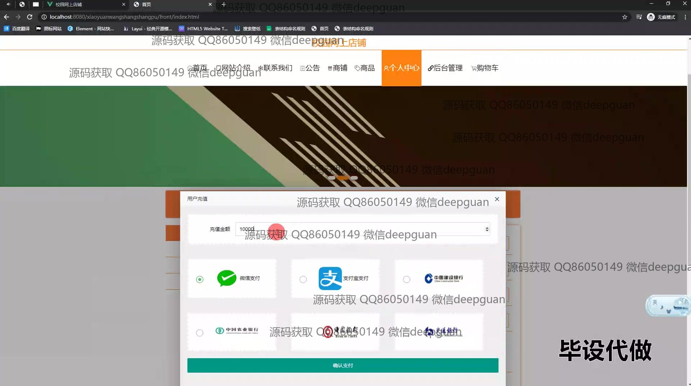

<h1 align="center">基于的校园网上店铺的设计与实现</h1>

## 简介
校园网上店铺系统：角色包括管理员与用户，提供商品管理、购物车功能、订单管理、用户信息编辑及登录注册功能，实现校园电商平台的综合管理与用户购物体验优化。    --计算机毕业设计源码；毕设源码；java毕业设计源码

## 联系方式

<h3 align="center">获取完整代码与数据库文件 + 微信：deepguan QQ: 86050149 QQ群: 783742310</h3>

<h3 align="center">可帮忙远程部署 包运行成功！提供远程部署、修改代码、设计文档指导、代码讲解等服务！</h3>

## 功能介绍（完整见运行截图）
管理员： 登录和注销功能，以便进行安全的后台管理。管理页面包括商店基本信息和会员等级类型设置，各类商品的增删改查，订单管理模块支持搜索和筛选功能。通过左侧导航栏访问公告管理、类目管理、用户管理等功能，还可以进行商铺认证管理、用户反馈审核及网站公告发布。提供详细操作按钮，例如查看、修改、删除及增加库存操作，在发货界面填写配送信息，管理用户数据如重置密码和编辑个人信息。

用户： 支持注册、登录和注销功能，允许用户浏览网站首页的商品推荐和店铺展示。商品模块包括商品分类浏览、商品详情查看及购物车管理功能，支持搜索商品名称或编号。在个人中心，用户可以修改个人信息，如用户名、手机号、邮箱和会员等级，查看历史订单和管理收货地址，上传头像和选择角色（如普通用户或商铺）。提供充值窗口，详细订单界面允许用户查看及申请退款。

## 运行截图

本代码来源于网络,仅供学习参考使用!

